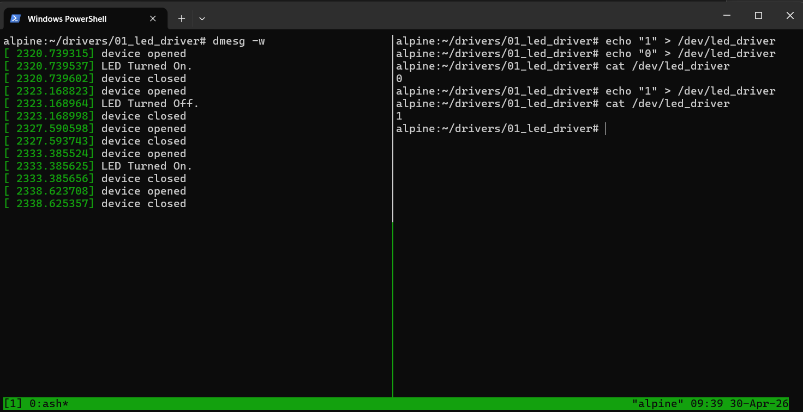

# LED Kernel Driver

A simple Linux loadable kernel module (LKM) that simulates LED control through a character device at `/dev/myled`.

## Build & Load

```bash
make
sudo insmod led_driver.ko
```

## Unload

```bash
sudo rmmod led_driver
```

## Usage

### Control the LED

```bash
echo "1" > /dev/led_driver   # turn ON
echo "0" > /dev/led_driver   # turn OFF
```

### Read current state

```bash
cat /dev/led_driver           # prints 0 or 1
```

## File Operations

| Operation | Handler | Description |
|-----------|---------|-------------|
| `write()` | `led_write` | Accepts `'0'` or `'1'` from userspace, updates led_state |
| `read()`  | `led_read`  | Returns current led_state as ASCII, EOF-safe for `cat` |

## Demo


